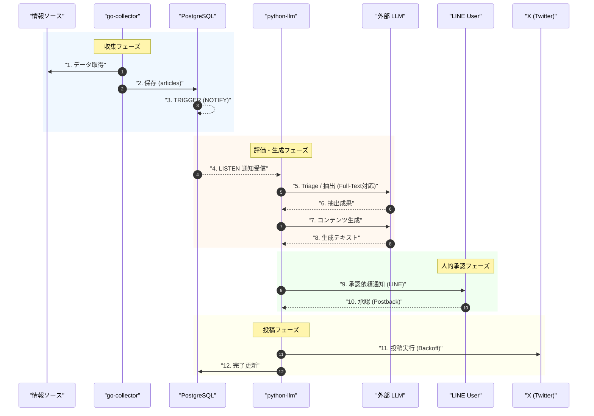

# データフロー図

システム全体のデータフローと処理の流れをまとめたドキュメントです。現在の実装に基づき、多面的な情報収集からLLMによる評価、SNS投稿までを一貫して管理する構成を記述しています。

## 1. システム構成と全体フロー (Flowchart)

`go-collector` による多種多様なソースからのデータ収集と、`python-llm` による高度な評価・コンテンツ生成の流れを表しています。

```mermaid
flowchart TD
    subgraph Sources ["情報ソース"]
        GH["GitHub Releases"]
        AR["arXiv Papers"]
        HF["Hugging Face Daily"]
        RSS["AI Blogs / RSS"]
    end

    subgraph GC ["go-collector (Go)"]
        Orch["Orchestrator<br/>Fast & Slow Scheduling"]
        Filt["Priority Filters"]
    end

    subgraph DB [("PostgreSQL")]
        Art[("articles")]
        Seen[("seen_articles")]
        Trig["NOTIFY Trigger"]
    end

    subgraph PL ["python-llm (Python/FastAPI)"]
        Lis["PG Listener<br/>Dedicated Connection"]
        Tri["Triage / Extractor<br/>Full-Text Attention"]
        Gen["Content Generation"]
        Post["X Posting Service<br/>Exponential Backoff"]
    end

    subgraph User ["Human-in-the-Loop"]
        LINE["LINE Messaging API<br/>Confirm Template"]
    end

    GH --> Orch
    AR --> Orch
    HF --> Orch
    RSS --> Orch

    Orch --> Filt
    Filt -->|Save| Art
    Art --> Trig
    Trig -->|NOTIFY| Lis
    Lis -->|Wake up| Tri
    
    Seen <-->|Deduplication| Orch

    Tri --> Gen
    Gen -->|Approval Request| LINE
    LINE -->|Approve/Reject| PL
    PL -->|Post| X["Social Media (X)"]
```

## 2. 処理シーケンス (Sequence Diagram)

「Event-Driven & Human-in-the-Loop」構成に基づき、記事収集から承認・投稿までの流れです。



## 各コンポーネントの役割

### go-collector (Go)
- **Multi-Source Fetching**: GitHub Releases, arXiv, Hugging Face Daily Papers, AI系技術ブログ（RSS）から最新情報を取得します。
- **Event Notification**: データベースへの保存後、PostgreSQLの `NOTIFY` を発行し、Python側へ即時に通知を送ります。
- **Robustness**: HTTP レートリミット（429）やサーバーエラー（5xx）に対し、ジッター付き指数バックオフを用いたリトライを行います。

### PostgreSQL (Database)
- **articles**: 収集した生データ、本文、フルコンテンツ、ステータスを保持。
- **NOTIFY Trigger**: 新規記事の INSERT 時に `new_article` チャネルへ JSON ペイロードを送信します。

### python-llm (Python / FastAPI)
- **PG Listener Service**: 常時接続を維持し、DB からの `NOTIFY` を待ち受けます。通知を受信すると即座にパイプラインを起動します。
- **Full-Text Attention Control**: 長文論文の処理時に、重要なセクションに LLM の注意を集中させる構造化プロンプト（Objective/Input/Constraints/Output）を適用します。
- **Human-in-the-Loop**: 生成完了後、LINE Messaging API を通じて承認依頼を送信。ユーザーのボタン操作（Postback）を受けて投稿フェーズへ進みます。
- **X Posting Service**: X API への投稿時に指数バックオフリトライを行い、API 制限下でも確実にスレッドを投稿します。
