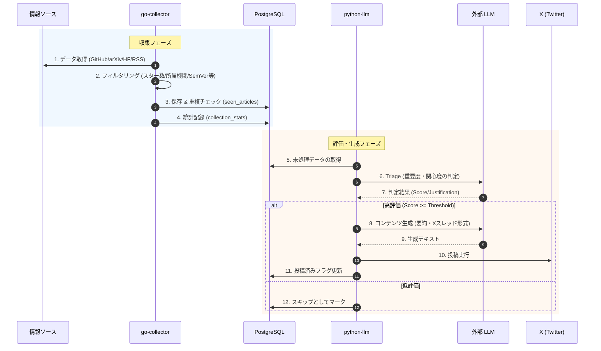

# データフロー図

システム全体のデータフローと処理の流れをまとめたドキュメントです。現在の実装に基づき、多面的な情報収集からLLMによる評価、SNS投稿までを一貫して管理する構成を記述しています。

## 1. システム構成と全体フロー (Flowchart)

`go-collector` による多種多様なソースからのデータ収集と、`python-llm` による高度な評価・コンテンツ生成の流れを表しています。

```mermaid
flowchart TD
    subgraph Sources [情報ソース]
        GH[GitHub Releases]
        AR[arXiv Papers]
        HF[Hugging Face Daily]
        RSS[AI Blogs / RSS]
    end

    subgraph GC [go-collector (Go)]
        Orch[Orchestrator\nFast & Slow Scheduling]
        Filt[Priority Filters\nInstitution/Stars/SemVer]
    end

    subgraph DB [(PostgreSQL)]
        Art[(articles)]
        Seen[(seen_articles)]
        Stats[(collection_stats)]
    end

    subgraph PL [python-llm (Python/FastAPI)]
        Tri[Triage Pipeline\nLLM Interest Evaluation]
        Gen[Content Generation\nSummarization / X Thread]
        Post[X Posting Service]
    end

    Sources -->|Fetch| Orch
    Orch --> Filt
    Filt -->|Save| DB
    
    Stats -.->|Metrics| Orch
    Seen <-->|Deduplication| Orch

    PL -->|Fetch Pending| Art
    PL -->|Analyze| LLM[外部 LLM (OpenAI等)]
    LLM -->|Metadata/Score| PL
    PL -->|Update Result| Art
    PL -->|Post| X[Social Media (X)]
```

## 2. 処理シーケンス (Sequence Diagram)

「Fast & Slow」アーキテクチャに基づき、緊急性の高いニュース（Breaking News）と通常の研究論文を効率的に処理する流れです。



## 各コンポーネントの役割

### go-collector (Go)
- **Multi-Source Fetching**: GitHub Releases, arXiv, Hugging Face Daily Papers, AI系技術ブログ（RSS）から最新情報を取得します。
- **Fast & Slow Architecture**: ニュース性（Breaking News）の有無に応じた動的なスケジューリングを行います。
- **Condition Filtering**: 
    - GitHub: スター数による人気判定、SemVerによるメジャー/マイナーアップデート判定。
    - arXiv: 著名研究機関（Google, OpenAI等）の所属スコアリング。
- **Observability**: `collection_stats` を通じて収集の健全性を定量化します。

### PostgreSQL (Database)
- **articles**: 収集した生データ、本文、フルコンテンツ、およびLLMによる評価結果を保存します。
- **seen_articles**: URL/IDベースの重複排除用テーブル。
- **collection_stats**: 各ソースのフェッチ成功数や取得件数の統計情報を保持します。

### python-llm (Python / FastAPI)
- **Triage Pipeline**: LLMを用いて「特定の専門領域における重要度」を評価し、ノイズを排除します。
- **Context Retrieval**: Triage用に最適化された軽量データと、生成用のフルコンテンツを使い分けることでコスト効率を向上させています。
- **X Posting Service**: 生成された要約や解説スレッドをX APIを通じて自動投稿します。
